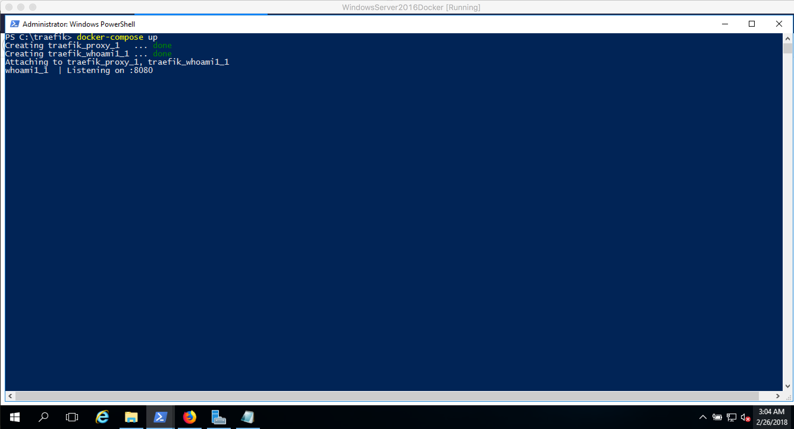
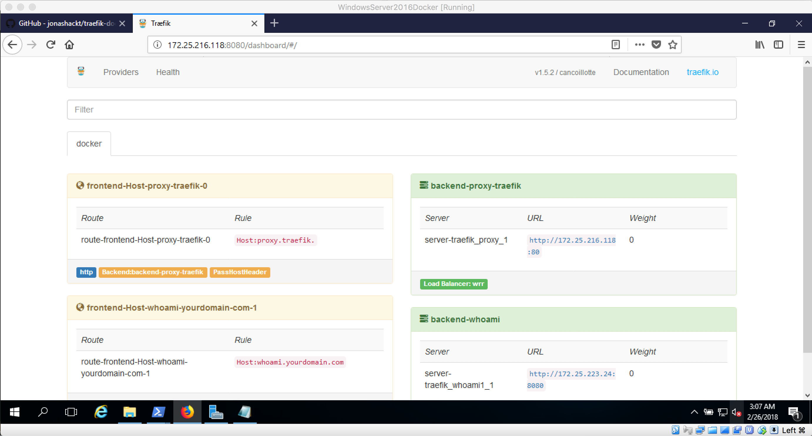

# traefik-docker-windows-server-2016
Example project showing how to run Traefik in a Windows Docker Container in Windows Server 2016 without the support of bind-mounting named pipes


# Problem

If you want to run Traefik on Windows Server 2016 (not 1709!), you don´t have support for named pipes mounting into your Docker Containers, which is needed for [Traefik](https://traefik.io/) to manage & proxy all your Docker Containers. So this configuration will only work on Windows Server 1709 ff - because it is [possible there to bind-mount named pipes](https://blog.docker.com/2017/09/docker-windows-server-1709/):

```
version: '3.4'

services:
  proxy:
    image: stefanscherer/traefik-windows
    command: --api --docker --logLevel=WARN --docker.endpoint=npipe:////./pipe/docker_engine
    networks:
      - default
    ports:
      - "80:80"
      - "8080:8080"
    volumes:
      - \\.\pipe\docker_engine:\\.\pipe\docker_engine
    restart:
      always

    logging:
      driver: "json-file"
      options:
        max-size: "500m"
        max-file: "3"

networks:
  default:
    external:
      name: nat

```

# TCP socket to the rescue

> If you need a Windows 2016 Vagrant box to comprehend the steps, just read the paragraph ["Building your Windows Server 2016 Vagrant box"](https://blog.codecentric.de/en/2017/04/ansible-docker-windows-containers-spring-boot/)

An alternative to named-pipes is maybe the access over [the TCP socket](https://docs.microsoft.com/en-us/virtualization/windowscontainers/manage-docker/configure-docker-daemon#configure-docker-with-configuration-file)?! Let´s try to configure this (thanks to [this gist](https://gist.github.com/alexellis/04d5fcc82ad5e9604bab0b6a0cf92bd9)):

```
stop-service docker
dockerd --unregister-service
dockerd --register-service -H npipe:// -H 0.0.0.0:2375
start-service docker
New-NetFirewallRule -Name "Dockerinsecure2375" -DisplayName "Docker insecure on TCP/2375" -Protocol tcp -LocalPort 2375 -Action Allow -Enabled True
```

These steps configure:

* the Docker daemon to accept requests on TCP 2375
* it also allows Requests to that TCP endpoint through the Windows Server firewall 

Now let´s configure Traefik to support the TCP socket configuration. First, we need to get the `Ethernet adapter vEthernet (HNS Internal NIC)` IPv4 adress. Therefore type `ipconfig` and extract it (thanks for [the hint, Stefan!](https://github.com/StefanScherer/dockerfiles-windows/blob/master/traefik/docker-compose.yml)). Then edit the following configuration:

```
version: '3.4'

services:
  proxy:
    image: stefanscherer/traefik-windows
    command: --api --docker --logLevel=WARN --docker.endpoint=tcp://YourHNSInternatNICIPv4Adress:2375
    networks:
      - default
    ports:
      - "80:80"
      - "8080:8080"
    volumes:
      - .:C:/etc/traefik
    restart:
      always
    logging:
      driver: "json-file"
      options:
        max-size: "500m"
        max-file: "3"

  whoami1:
    image: stefanscherer/whoami
    labels:
      - "traefik.backend=whoami"
      - "traefik.frontend.rule=Host:whoami.yourdomain.com"

networks:
  default:
    external:
      name: nat
```

Now do a `docker-compose up` where your `docker-compose.yml` has been saved. You should get an output like that:



Now do a `docker inspect nat` on an other Powershell and search for the Docker IP address of Traefik. Paste this IP with 8080 appended into the Browser and you should see the running Traefik webinterface with a `whoami` Docker Compose service registered:




